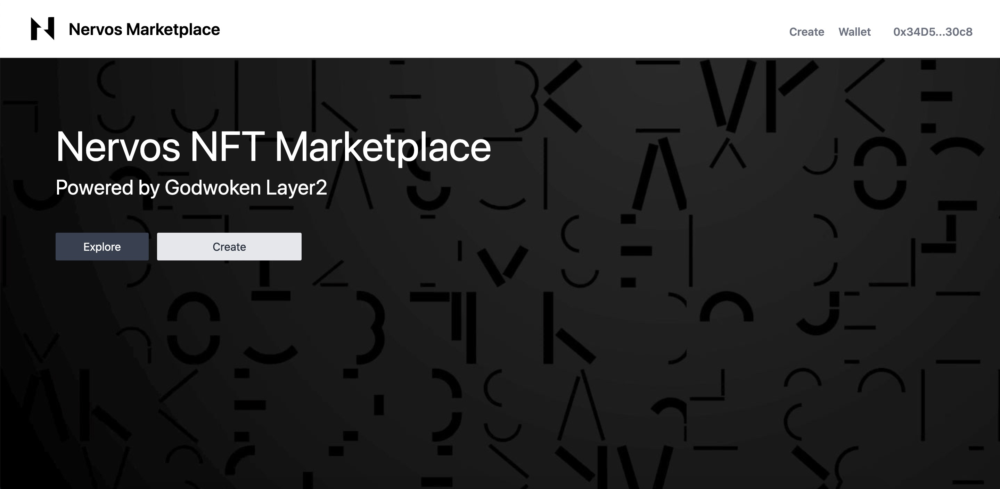
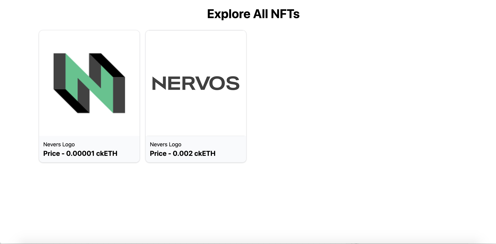
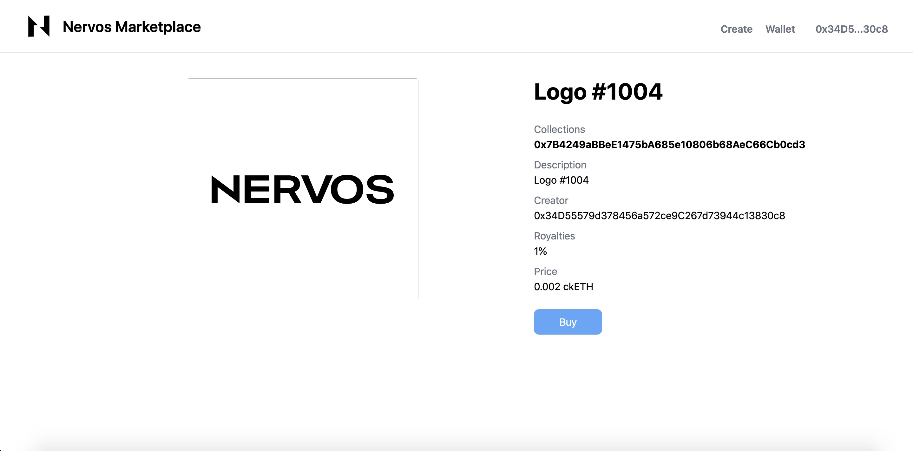
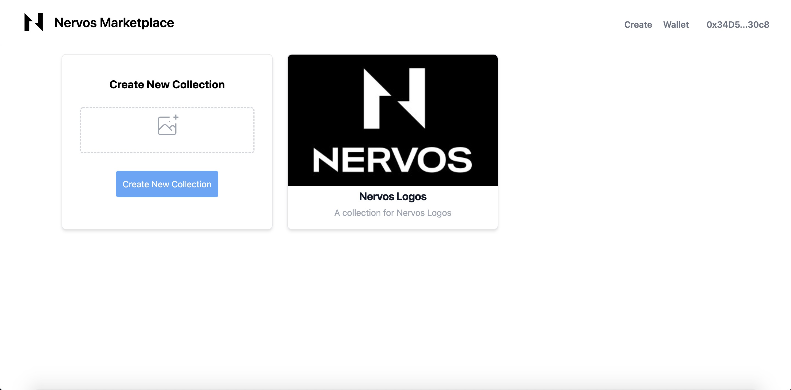

# Nervos-NFT-Marketplace
[Gitcoin GR13 Hackathons](https://gitcoin.co/issue/nervosnetwork/grants/21/100027878) project for building a NFT marketplace on Nervos Godwoken.

## Overview
 Nervos NFT Marketplace is a set of open source smart contracts for implementing ERC721 token exchange capabilities on [Nervos Godwoken](https://www.nervos.org/godwoken). User can mint and list ERC721 tokens on Nervos Marketplace. ckETH on Godwoken is used as the native token for trading NFTs.

## Project Setup 
### Compile and Deploy Contracts 
- cd contract
- yarn hardhat compile
- ./godwoken_deploy.js

### Web
- cd web
- yarn 
- yarn serve

## Deployed Contracts on Godwoken Testnet
- CollectionFactory - Smart Contract that deploys Collection contracts and stores metadata
  
    `0x4C382de5E8c0bCBa6B9030Ebb08b3fCb0c776bD8`             
        
- MarketPlace - Smart Contract that manages, Buy, Sell and Auction of NFTs
    
    `0x8229bAe96bca6e52344001f5c7b258b3Bf6A5A3F`
## Tech Stack Used
 - Vue
 - Hardhat
 - Web3.js
 - Tailwind

## Screenshots
- Main page

- Listed NFTs

- NFT detail

- Create NFT collection

- Collection NFTs

## [Demo Site](https://nervos-nft-marketplace.vercel.app/)

## YouTube Demo

https://youtu.be/pypjbgEDS88
